### 诚毅课表Json手动生成器

---

* 项目动机：诚毅学院无法访问获取到课表json数据，无法使用json翻译程序转换成ics文件导入课表

#### 运行环境：

jre1.8 或更新

---

#### 使用教程：

* 安装Java运行环境：可参考 https://jingyan.baidu.com/article/4e5b3e1909043f91911e2464.html

* 访问 https://github.com/GnaixEuy/chengyiScheduleTranslator/releases/tag/v1.0 下载jar包

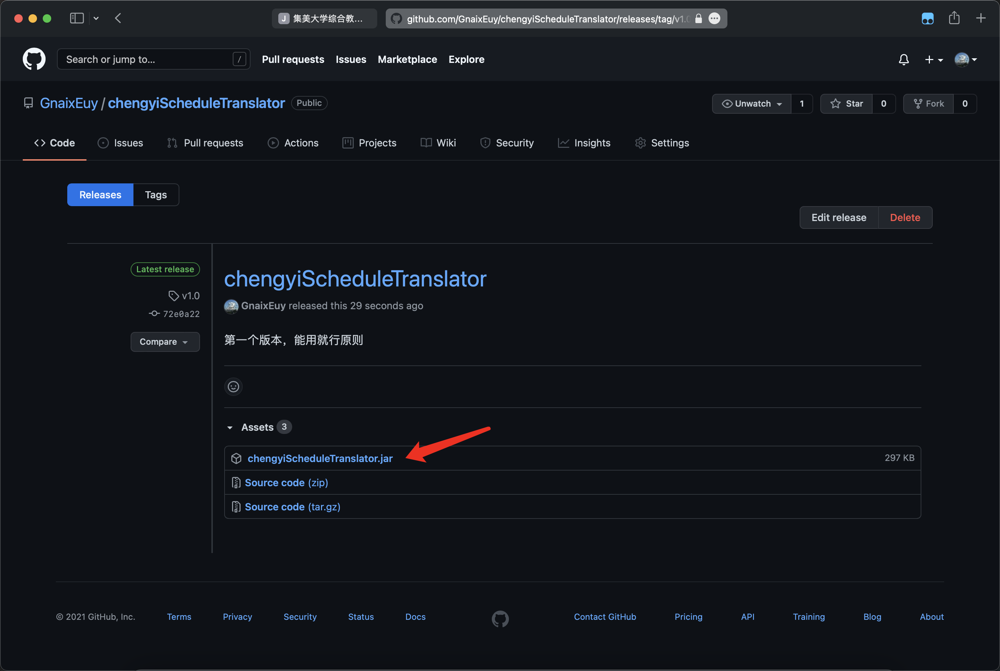

* 双击运行

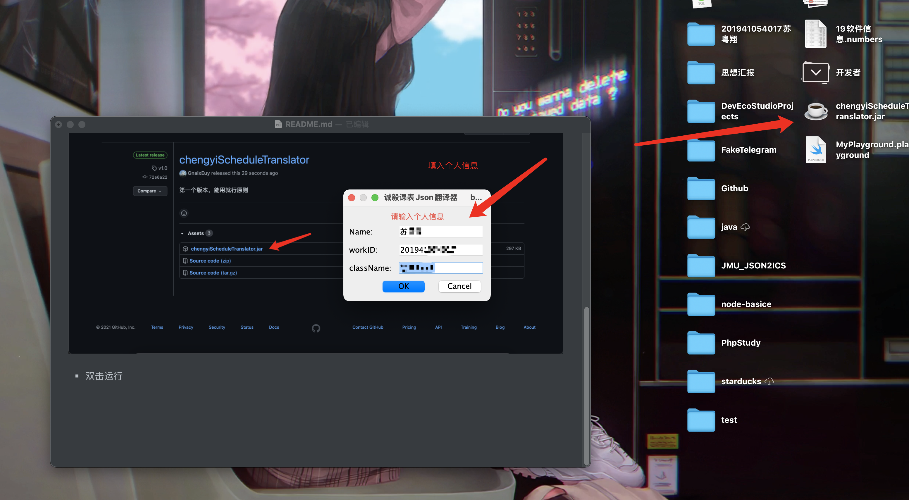

* 填入课程信息

  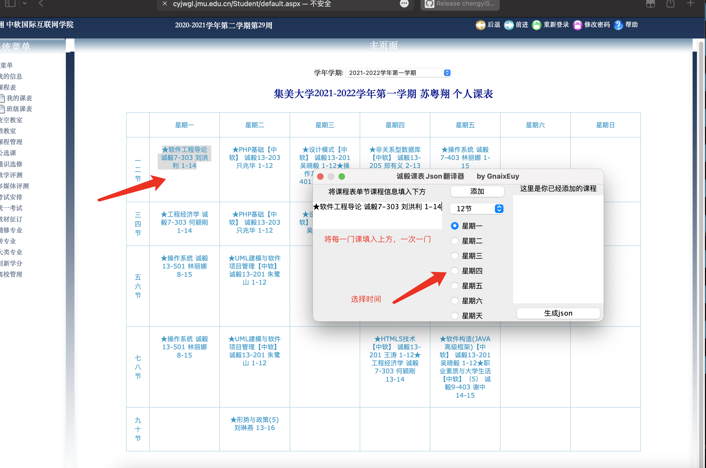

* 注意事项

  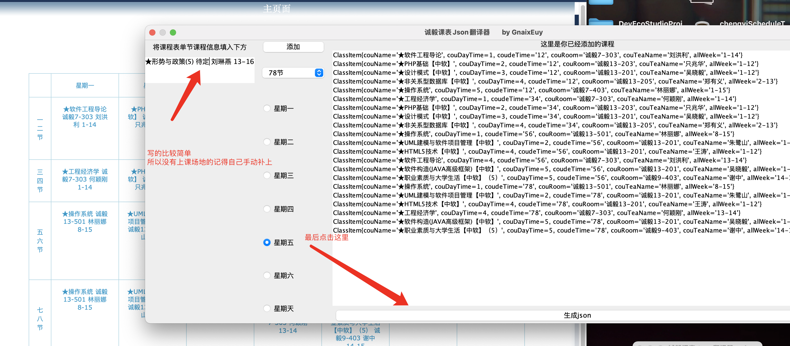

* 生成成功，复制json 移步JMU_JSON2ICS

  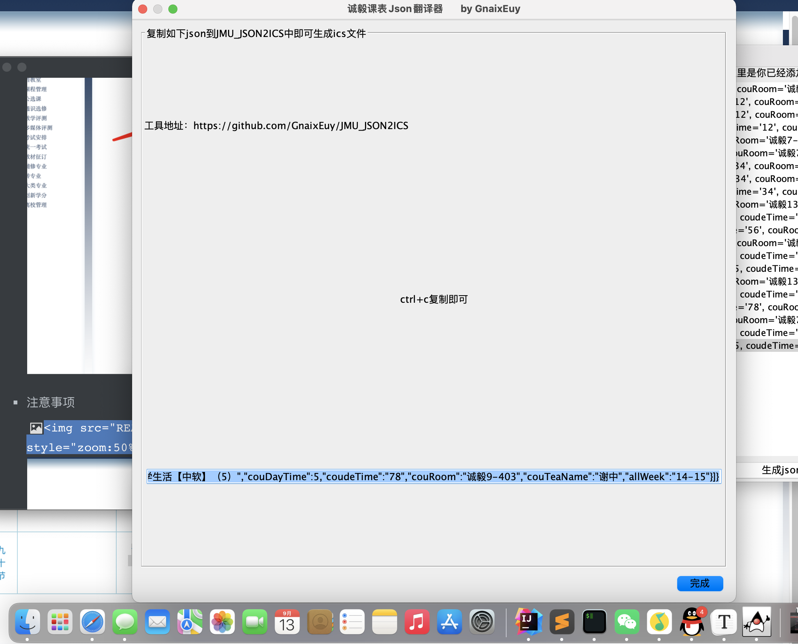

---

#### JMU_JSON2ICS生成ics

保存好上方的json，移步JMU_JSON2ICS，地址 https://github.com/GnaixEuy/JMU_JSON2ICS

如何运行？

* 安装python3环境，参考 https://jingyan.baidu.com/article/92255446605bd8851648f4f9.html

* 使用git clone项目

  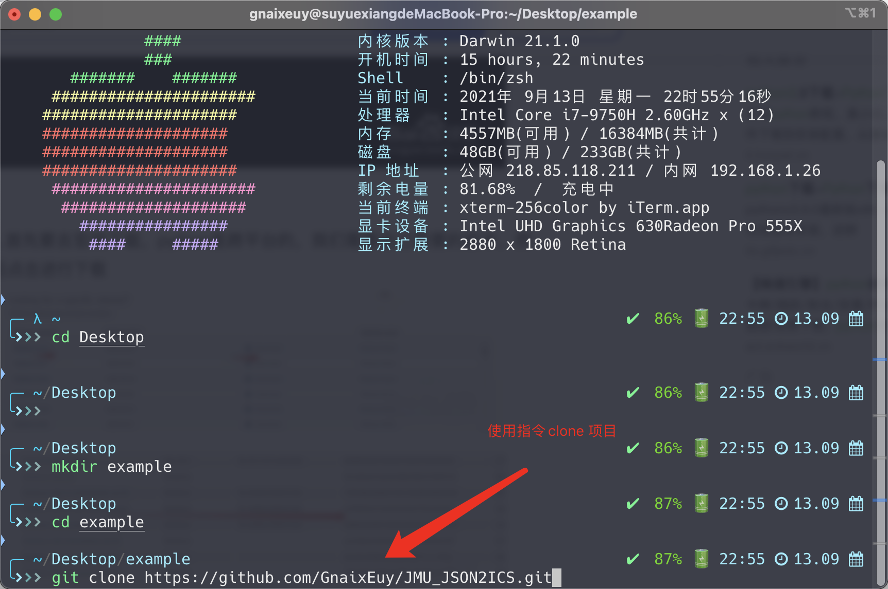

* cd 进项目里

  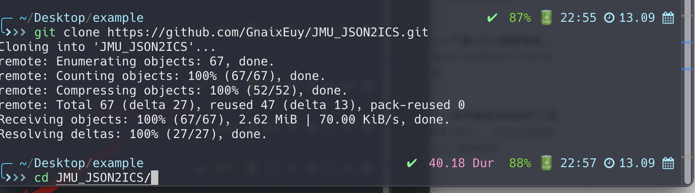

* 填入信息

  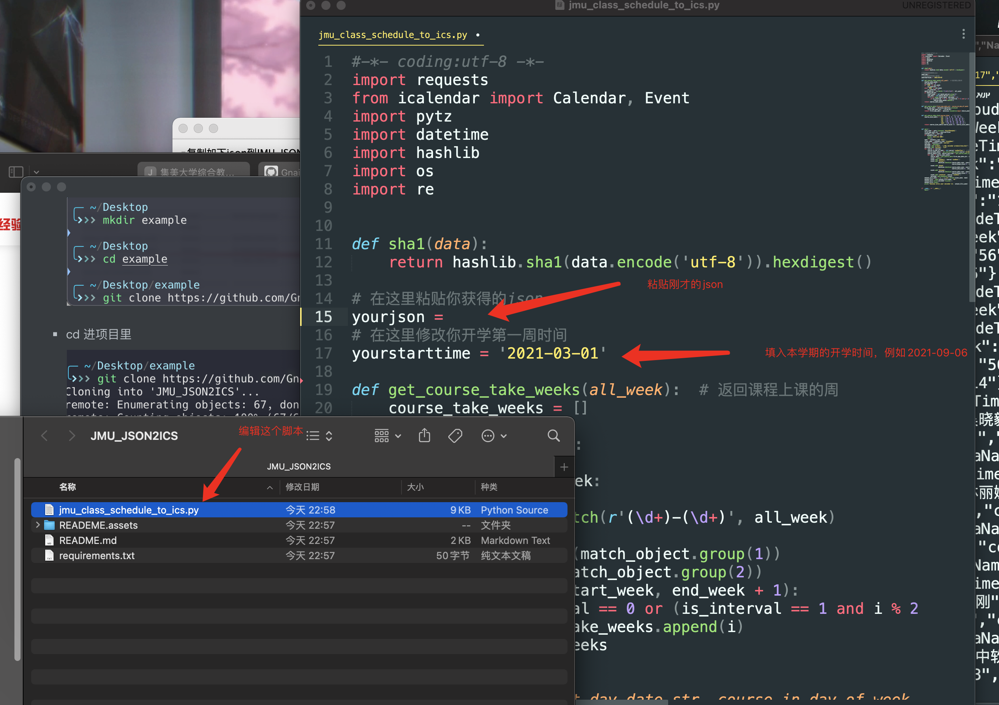

* 运行脚本，得到文件

  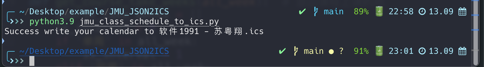

* 双击文件导入日历软件即可

  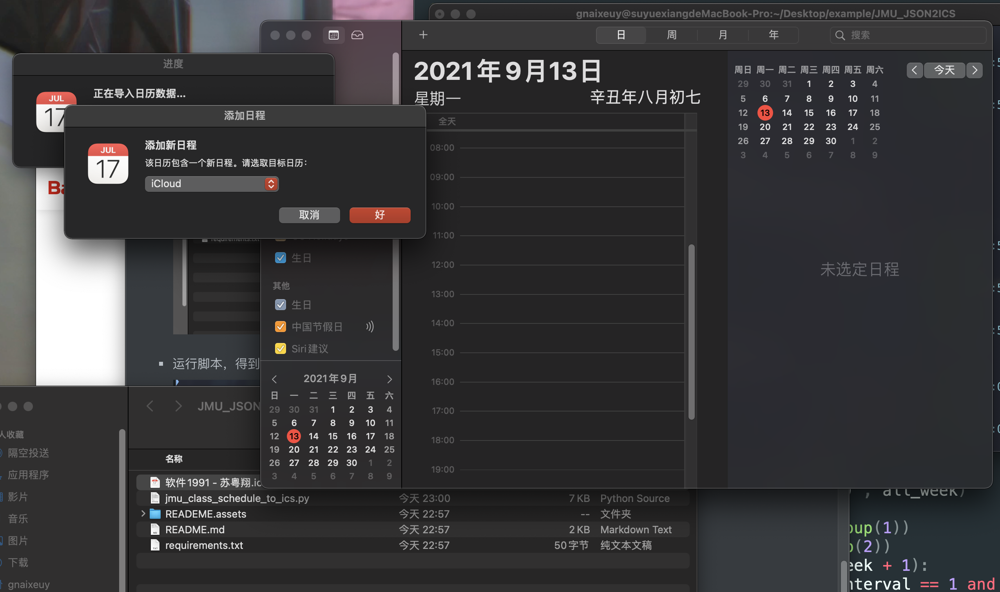

* 结束，享受不用记课表的生活吧！

  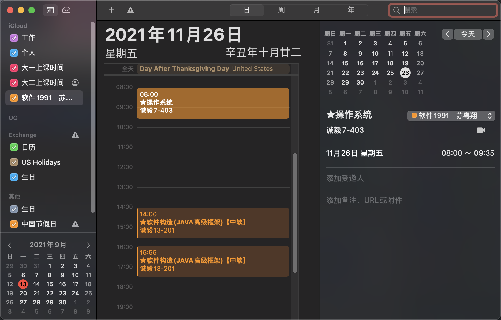